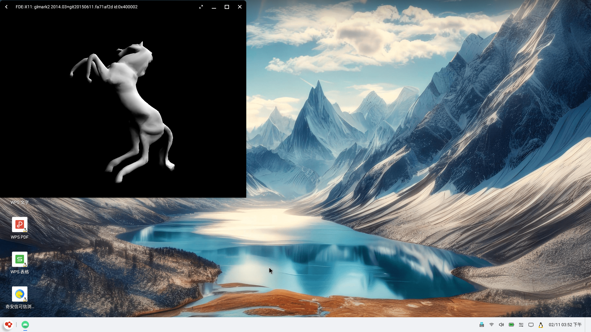

### Idea form

``
https://github.com/termux/termux-x11``

``
https://github.com/pelya/xserver-xsdl``

``
https://github.com/nwrkbiz/android-xserver
``

## About Me
A X11 server run on Android without termux, activity action as X App window.

Know me in this video  【OpenFDE技术解说（三）：突破vnc局限，在Android上解锁linux多窗口自由体验】 https://www.bilibili.com/video/BV11LpMe5EJD/?share_source=copy_web&vd_source=76fa969b8f4d1dfa9c5ce09782a90c28

## How to use

click FDE-X11 will show linux app list

or

on android adb: adb shell am startservice -n com.fde.x11/.XWindowService
on linux: export DISPLAY=:1000 && firefox

## Test Result

### X11 Test Suite

The X Test Suite is the test suite for core rendering in the X Server.
https://www.x.org/wiki/BuildingXtest/?spm=5176.28103460.0.0.46bc5d27jM39Qz
https://www.x.org/wiki/XorgTesting/

| Test SET | CASES | TESTS | PASS | UNSUP | UNTST | NOTIU | WARN | FIP  | FAIL | UNRES | UNIN | ABORT | PASS rate | FAIL rate | UNRES rate | Comparison:银河kylin v10/ubuntu22 |
|----------| ------ | -------- | ---- | ------ | ------ | ------ | ---- | ---- | ---- | ------ | ---- | ---- |-----------|-----------|------------|---------------------------------|
| Xproto   | 122    | 389      | 290  | 2      | 19     | 0      | 0    | 0    | 2    | 76     | 0    | 0    | 74.55%    | 0.51%     | 19.54%     | font相关/只能用tcp测试                 |
| Xlib3    | 109    | 161      | 113  | 6      | 25     | 1      | 0    | 0    | 8    | 8      | 0    | 0    | 70.19%    | 4.97%     | 4.97%      | 优于对比平台                          |
| Xlib4    | 29     | 324      | 289  | 8      | 19     | 5      | 0    | 0    | 1    | 2      | 0    | 0    | 89.20%    | 0.31%     | 0.62%      | 优于对比平台                          |
| Xlib5    | 15     | 84       | 76   | 2      | 5      | 0      | 0    | 0    | 1    | 0      | 0    | 0    | 90.48%    | 1.19%     | 0.00%      | 优于对比平台                          |
| Xlib6    | 8      | 50       | 18   | 0      | 18     | 0      | 0    | 0    | 0    | 14     | 0    | 0    | 36.00%    | 0.00%     | 28.00%     | font相关                          |
| Xlib7    | 58     | 172      | 143  | 9      | 13     | 0      | 0    | 0    | 5    | 2      | 0    | 0    | 83.14%    | 2.91%     | 1.16%      | 等于对比平台                          |
| Xlib8    | 29     | 165      | 130  | 10     | 22     | 0      | 0    | 0    | 0    | 3      | 0    | 0    | 78.79%    | 0.00%     | 1.82%      | font相关                          |
| Xlib9    | 46     | 1472     | 948  | 17     | 27     | 190    | 8    | 0    | 30   | 16     | 236  | 0    | 64.40%    | 2.04%     | 1.09%      | 对比平台测试不了                        |
| Xlib10   | 23     | 95       | 56   | 1      | 36     | 0      | 0    | 0    | 1    | 1      | 0    | 0    | 58.95%    | 1.05%     | 1.05%      | 优于对比平台                          |
| Xlib11   | 33     | 195      | 65   | 22     | 4      | 43     | 0    | 0    | 56   | 5      | 0    | 0    | 33.33%    | 28.72%    | 2.56%      | 优于对比平台                          |
| Xlib12   | 27     | 138      | 104  | 2      | 15     | 12     | 0    | 0    | 4    | 1      | 0    | 0    | 75.36%    | 2.90%     | 0.72%      | 优于对比平台                          |
| Xlib13   | 32     | 269      | 170  | 3      | 10     | 3      | 0    | 0    | 65   | 18     | 0    | 0    | 63.20%    | 24.16%    | 6.69%      | 优于对比平台                          |
| Xlib14   | 45     | 58       | 19   | 0      | 5      | 0      | 0    | 0    | 34   | 0      | 0    | 0    | 32.76%    | 58.62%    | 0.00%      | font相关                          |
| Xlib15   | 45     | 159      | 122  | 0      | 33     | 0      | 0    | 0    | 1    | 3      | 0    | 0    | 76.73%    | 0.63%     | 1.89%      | 等于对比平台                          |
| Xlib16   | 30     | 105      | 82   | 1      | 22     | 0      | 0    | 0    | 0    | 0      | 0    | 0    | 78.10%    | 0.00%     | 0.00%      | 等于对比平台                          |
| Xlib17   | 55     | 131      | 107  | 0      | 21     | 0      | 0    | 0    | 3    | 0      | 0    | 0    | 81.68%    | 2.29%     | 0.00%      | 优于对比平台                          |
| Xopen    | 8      | 127      | 125  | 2      | 0      | 0      | 0    | 0    | 0    | 0      | 0    | 0    | 98.43%    | 0.00%     | 0.00%      | 等于对比平台                          |
| Xt3      | 21     | 73       | 73   | 0      | 0      | 0      | 0    | 0    | 0    | 0      | 0    | 0    | 100.00%   | 0.00%     | 0.00%      | 等于对比平台                          |
| Xt4      | 33     | 192      | 94   | 0      | 98     | 0      | 0    | 0    | 0    | 0      | 0    | 0    | 48.96%    | 0.00%     | 0.00%      | 优于对比平台                          |
| Xt5      | 10     | 69       | 28   | 0      | 41     | 0      | 0    | 0    | 0    | 0      | 0    | 0    | 40.58%    | 0.00%     | 0.00%      | 等于对比平台                          |
| Xt6      | 7      | 71       | 68   | 0      | 0      | 0      | 0    | 0    | 0    | 3      | 0    | 0    | 95.77%    | 0.00%     | 4.23%      | 等于对比平台                          |
| Xt7      | 11     | 106      | 95   | 0      | 6      | 3      | 0    | 0    | 2    | 0      | 0    | 0    | 89.62%    | 1.89%     | 0.00%      | 等于对比平台                          |
| Xt8      | 7      | 43       | 35   | 0      | 4      | 0      | 0    | 0    | 0    | 4      | 0    | 0    | 81.40%    | 0.00%     | 9.30%      | 等于对比平台                          |
| Xt9      | 33     | 189      | 132  | 2      | 55     | 0      | 0    | 0    | 0    | 0      | 0    | 0    | 69.84%    | 0.00%     | 0.00%      | 优于对比平台                          |
| Xt10     | 8      | 17       | 16   | 0      | 1      | 0      | 0    | 0    | 0    | 0      | 0    | 0    | 94.12%    | 0.00%     | 0.00%      | 等于对比平台                          |
| Xt11     | 58     | 285      | 248  | 0      | 34     | 0      | 2    | 0    | 1    | 0      | 0    | 0    | 87.02%    | 0.35%     | 0.00%      | 等于对比平台                          |
| Xt12     | 22     | 67       | 56   | 0      | 11     | 0      | 0    | 0    | 0    | 0      | 0    | 0    | 83.58%    | 0.00%     | 0.00%      | 优于对比平台                          |
| Xt13     | 39     | 178      | 125  | 0      | 47     | 0      | 0    | 0    | 0    | 6      | 0    | 0    | 70.22%    | 0.00%     | 3.37%      | 等于对比平台                          |
| Xt14     | 2      | 18       | 18   | 0      | 0      | 0      | 0    | 0    | 0    | 0      | 0    | 0    | 100.00%   | 0.00%     | 0.00%      | 等于对比平台                          |
| Xt15     | 1      | 2        | 0    | 2      | 0      | 0      | 0    | 0    | 0    | 0      | 0    | 0    | 0.00%     | 0.00%     | 0.00%      | 等于对比平台                          |
| XtC      | 29     | 147      | 90   | 1      | 56     | 0      | 0    | 0    | 0    | 0      | 0    | 0    | 61.22%    | 0.00%     | 0.00%      | 优于对比平台                          |
| XtE      | 1      | 1        | 1    | 0      | 0      | 0      | 0    | 0    | 0    | 0      | 0    | 0    | 100.00%   | 0.00%     | 0.00%      | 等于对比平台                          |
| ShapeEx  | 11     | 11       | 11   | 0      | 0      | 0      | 0    | 0    | 0    | 0      | 0    | 0    | 100.00%   | 0.00%     | 0.00%      | 等于对比平台                          |
| XI       | 36     | 316      | 185  | 2      | 48     | 5      | 0    | 0    | 57   | 19     | 0    | 0    | 58.54%    | 18.04%    | 6.01%      | 优于对比平台                          |
| XIproto  | 35     | 107      | 58   | 0      | 12     | 0      | 0    | 0    | 7    | 30     | 0    | 0    | 54.21%    | 6.54%     | 28.04%     | 略低于/只能用tcp测试                    |
| TOTAL    | 1078   | 5986     | 4190 | 92     | 707    | 262    | 10   | 0    | 278  | 211    | 236  | 0    | 70.00%    | 4.64%     | 3.52%      |                                 |

### x11perf (partial test)

Tests performance of most ( non render ext ) X operations.
Available packaged in most distributions.
https://gitlab.freedesktop.org/xorg/test/x11perf

| x11perf - X11 performance program, version 1.2               |                                                              |
| ------------------------------------------------------------ | ------------------------------------------------------------ |
| The X.Org Foundation server version 12008000 on :0           | The X.Org Foundation server version 12101099 on :1001        |
| from huyang-pc                                               | from huyang-pc                                               |
| Sat Feb 8 15:15:12 2025                                      | Sat Feb 8 15:18:06 2025                                      |
| 银河kylin桌面                                                | FDE-X11                                                      |
| Running test: -dot                                           | Running test: -dot                                           |
| 2000000000 trep @  0.0000 msec (76200000.0/sec): Dot         | 1500000000 trep @  0.0000 msec (58900000.0/sec): Dot         |
| Running test: -line10                                        | Running test: -line10                                        |
| 2000000000 trep @  0.0000 msec (69100000.0/sec): 10-pixel line | 450000000 trep @  0.0001 msec (19500000.0/sec): 10-pixel line |
| Running test: -fcircle10                                     | Running test: -fcircle10                                     |
| 100000000 trep @  0.0003 msec (3840000.0/sec): 10-pixel solid circle | 20000000 trep @  0.0014 msec (731000.0/sec): 10-pixel solid circle |
| Running test: -triangle10                                    | Running test: -triangle10                                    |
| 1500000 trep @  0.0172 msec ( 58100.0/sec): Fill 10x10 equivalent triangle | 1500000 trep @  0.0202 msec ( 49600.0/sec): Fill 10x10 equivalent triangle |
| Running test: -line                                          | Running test: -line                                          |
| 1000000000 trep @  0.0000 msec (37700000.0/sec): 1-pixel line | 2000000000 trep @  0.0000 msec (73900000.0/sec): 1-pixel line |
| Running test: -line10                                        | Running test: -line10                                        |
| 450000000 trep @  0.0001 msec (17300000.0/sec): 10-pixel line | 2000000000 trep @  0.0000 msec (69000000.0/sec): 10-pixel line |
| Running test: -line100                                       | Running test: -line100                                       |
| 100000000 trep @  0.0005 msec (2120000.0/sec): 100-pixel line | 200000000 trep @  0.0002 msec (6360000.0/sec): 100-pixel line |
| Running test: -line500                                       | Running test: -line500                                       |
| 15000000 trep @  0.0020 msec (506000.0/sec): 500-pixel line  | 40000000 trep @  0.0007 msec (1480000.0/sec): 500-pixel line |
| Running test: -dline10                                       | Running test: -dline10                                       |
| 200000000 trep @  0.0001 msec (7610000.0/sec): 10-pixel dashed line | 350000000 trep @  0.0001 msec (13800000.0/sec): 10-pixel dashed line |
| Running test: -dline100                                      | Running test: -dline100                                      |
| 50000000 trep @  0.0005 msec (1910000.0/sec): 100-pixel dashed line | 200000000 trep @  0.0001 msec (7490000.0/sec): 100-pixel dashed line |
| Running test: -ddline100                                     | Running test: -ddline100                                     |
| 45000000 trep @  0.0006 msec (1660000.0/sec): 100-pixel double-dashed line | 200000000 trep @  0.0002 msec (6070000.0/sec): 100-pixel double-dashed line |
| Running test: -wline10                                       | Running test: -wline10                                       |
| 15000000 trep @  0.0021 msec (486000.0/sec): 10x1 wide line  | 2500000 trep @  0.0119 msec ( 84000.0/sec): 10x1 wide line   |
| Running test: -wline100                                      | Running test: -wline100                                      |
| 2000000 trep @  0.0155 msec ( 64600.0/sec): 100x10 wide line | 2000000 trep @  0.0147 msec ( 68200.0/sec): 100x10 wide line |
| Running test: -wline500                                      | Running test: -wline500                                      |
| 500000 trep @  0.0801 msec ( 12500.0/sec): 500x50 wide line  | 1000000 trep @  0.0256 msec ( 39000.0/sec): 500x50 wide line |
| Running test: -wdline100                                     | Running test: -wdline100                                     |
| 1000000 trep @  0.0283 msec ( 35400.0/sec): 100x10 wide dashed line | 400000 trep @  0.0635 msec ( 15700.0/sec): 100x10 wide dashed line |
| Running test: -wddline100                                    | Running test: -wddline100                                    |
| 1000000 trep @  0.0279 msec ( 35800.0/sec): 100x10 wide double-dashed line | 450000 trep @  0.0557 msec ( 18000.0/sec): 100x10 wide double-dashed line |

### glmark2

=======================================================

glmark2 2014.03+git20150611.fa71af2d

=======================================================

OpenGL Information

GL_VENDOR:     X.Org

GL_RENDERER:   AMD CAICOS (DRM 2.50.0 / 5.4.18-110-generic, LLVM 11.0.0)

GL_VERSION:    3.1 Mesa 20.0.8

[build] use-vbo=false: FPS: 1106 FrameTime: 0.904 ms
[build] use-vbo=true: FPS: 1299 FrameTime: 0.770 ms
[texture] texture-filter=nearest: FPS: 1122 FrameTime: 0.891 ms
[texture] texture-filter=linear: FPS: 1101 FrameTime: 0.908 ms
[texture] texture-filter=mipmap: FPS: 1174 FrameTime: 0.852 ms
[shading] shading=gouraud: FPS: 895 FrameTime: 1.117 ms
[shading] shading=blinn-phong-inf: FPS: 913 FrameTime: 1.095 ms
[shading] shading=phong: FPS: 940 FrameTime: 1.064 ms
[shading] shading=cel: FPS: 920 FrameTime: 1.087 ms
[bump] bump-render=high-poly: FPS: 459 FrameTime: 2.179 ms
[bump] bump-render=normals: FPS: 1313 FrameTime: 0.762 ms
[bump] bump-render=height: FPS: 1291 FrameTime: 0.775 ms
libpng warning: iCCP: known incorrect sRGB profile
[effect2d] kernel=0,1,0;1,-4,1;0,1,0;: FPS: 671 FrameTime: 1.490 ms
libpng warning: iCCP: known incorrect sRGB profile
[effect2d] kernel=1,1,1,1,1;1,1,1,1,1;1,1,1,1,1;: FPS: 316 FrameTime: 3.165 ms
[pulsar] light=false:quads=5:texture=false: FPS: 923 FrameTime: 1.083 ms
libpng warning: iCCP: known incorrect sRGB profile
[desktop] blur-radius=5:effect=blur:passes=1:separable=true:windows=4: FPS: 256 FrameTime: 3.906 ms
libpng warning: iCCP: known incorrect sRGB profile
[desktop] effect=shadow:windows=4: FPS: 532 FrameTime: 1.880 ms
[buffer] columns=200:interleave=false:update-dispersion=0.9:update-fraction=0.5:update-method=map: FPS: 230 FrameTime: 4.348 ms
[buffer] columns=200:interleave=false:update-dispersion=0.9:update-fraction=0.5:update-method=subdata: FPS: 585 FrameTime: 1.709 ms
[buffer] columns=200:interleave=true:update-dispersion=0.9:update-fraction=0.5:update-method=map: FPS: 228 FrameTime: 4.386 ms
[ideas] speed=duration: FPS: 653 FrameTime: 1.531 ms
[jellyfish] <default>: FPS: 366 FrameTime: 2.732 ms
[terrain] <default>: FPS: 52 FrameTime: 19.231 ms
[shadow] <default>: FPS: 248 FrameTime: 4.032 ms
[refract] <default>: FPS: 63 FrameTime: 15.873 ms
[conditionals] fragment-steps=0:vertex-steps=0: FPS: 881 FrameTime: 1.135 ms
[conditionals] fragment-steps=5:vertex-steps=0: FPS: 698 FrameTime: 1.433 ms
[conditionals] fragment-steps=0:vertex-steps=5: FPS: 715 FrameTime: 1.399 ms
[function] fragment-complexity=low:fragment-steps=5: FPS: 951 FrameTime: 1.052 ms
[function] fragment-complexity=medium:fragment-steps=5: FPS: 839 FrameTime: 1.192 ms
[loop] fragment-loop=false:fragment-steps=5:vertex-steps=5: FPS: 892 FrameTime: 1.121 ms
[loop] fragment-steps=5:fragment-uniform=false:vertex-steps=5: FPS: 894 FrameTime: 1.119 ms

[loop] fragment-steps=5:fragment-uniform=true:vertex-steps=5: FPS: 700 FrameTime: 1.429 ms

=======================================================

glmark2 Score: 734

=======================================================

